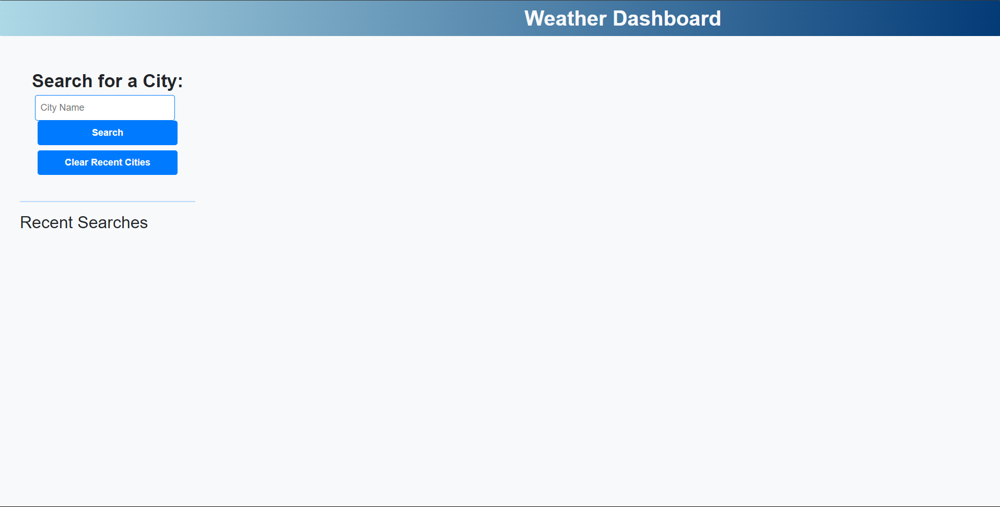
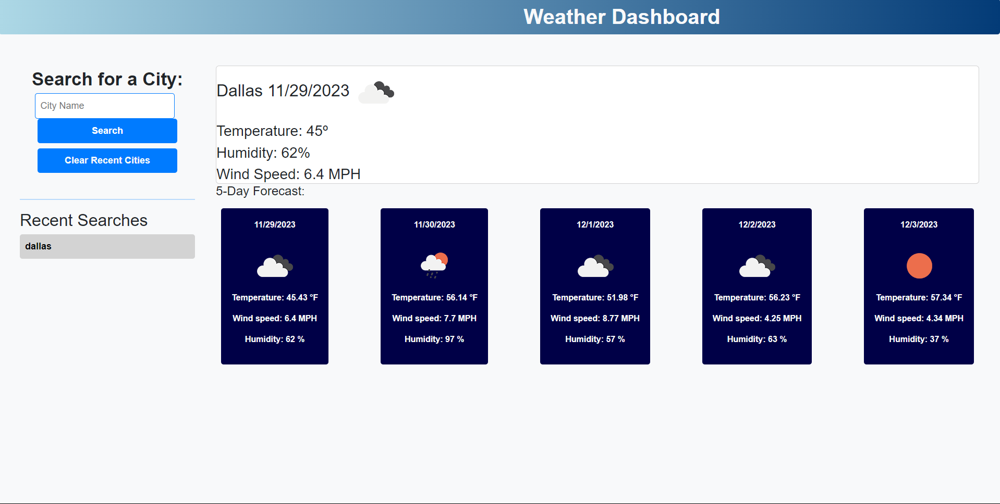

# WeatherWhisper
Weather Dashboard with dynamically updating HTML and CSS.  This project was so much fun.  Messing with the API and getting the weather forecast to work just right and display cleanly was quite the challenge.  I learned so much about css on this project although there was quite a bit of javascript that was challenging enough.  Please enjoy the application!!!!
## Weather API Link
https://github.com/Carmetlo/WeatherWhisper
## Deployed Application

## Application Description
Whether you are searching for a place to vacation or planning a road trip, Weather Whisper can help display the weather in that area along with a 5-day forecast!  Follow these steps to get the most out of your all in one weather planner!

Step 1.  Enter the city you would like to view.

Step 2.  Once you enter the city name and click search then the weather and the 5-day forecast is displayed to the right.

Step 3.  You can look up multiple cities and recall them anytime you like.

Step 4.  If you are planning another vacation or re-routed your road trip, you can clear your search history by clicking the "Clear Recent Cities" button.

Thank you so much for checking out my application!  Happy coding!

